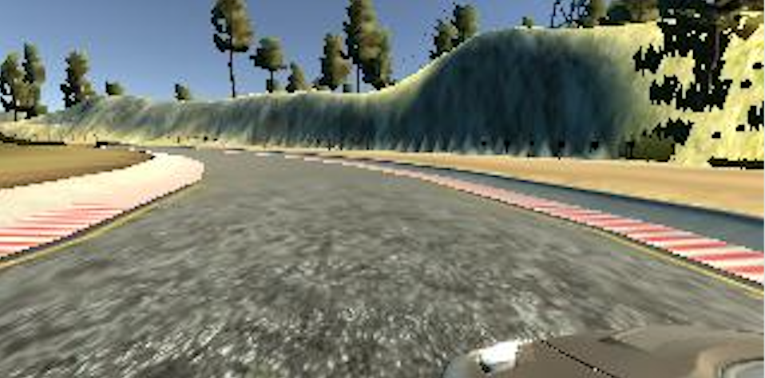
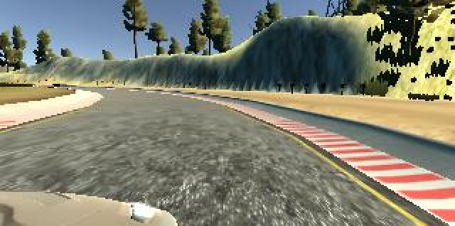
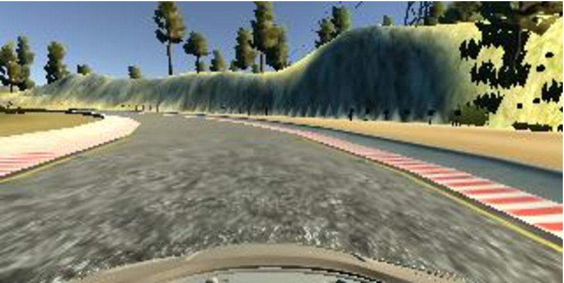
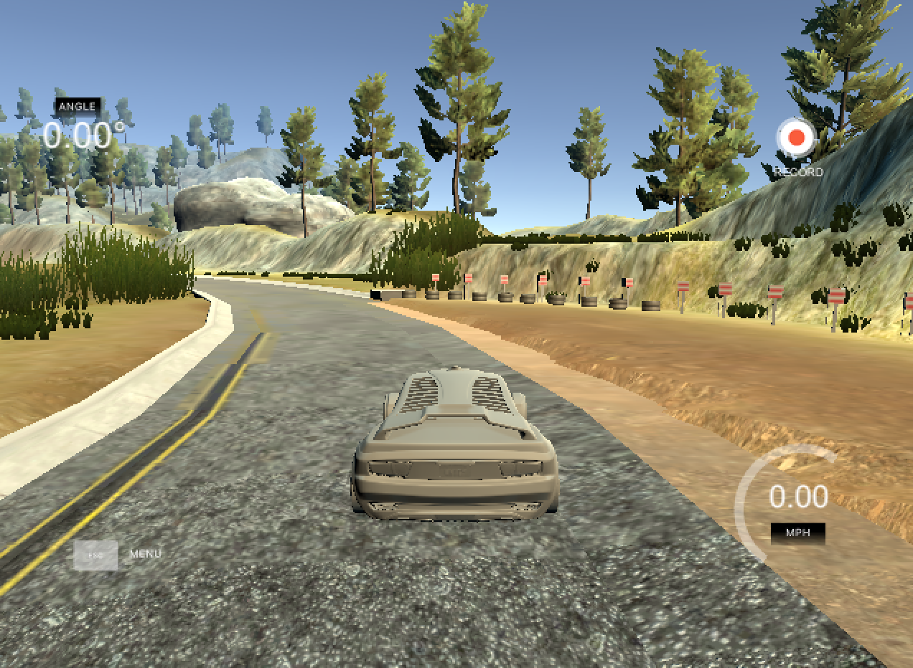

#**Behavioral Cloning**

###Model Architecture and Training Strategy

####1. An appropriate model architecture has been employed

My model consists of five convolution layers (model.py lines 78-82). The first 3 convolution layers have size of 5x5 and depths of 24, 36, while the other 2 have size of 3x3 and depths of 64. There are 4 fully connected layers with output size of 100, 50, 10 and 1 (model.py lines 84-87). This is the nvidia model recommended by the lesson and I found it very effective in training the car the drive.

The model includes RELU layers to introduce nonlinearity (code line 78-82), and the data is normalized in the model using a Keras lambda layer (code line 77).

A preprocessing layer is used to crop the image from the 70 pixels from the top to 25 pixels from the bottom (code line 76).

####2. Attempts to reduce overfitting in the model

I did not include any regularization (dropout layers for example) in the model. Originally I tried including some dropout layers in the model, however, the nvidia model seems not to learn very well with the dropout layers.

The model was trained and validated on different data sets (training:validation = 8:2) to ensure that the model was not overfitting (code line 118-121). The model was tested by running it through the simulator and ensuring that the vehicle could stay on the track.

####3. Model parameter tuning

The model used an adam optimizer, so the learning rate was not tuned manually (model.py line 113).

The only parameter that I tune a lot was the epochs I used to train the model. I tried many different combinations and found epoch 15 works the best.

####4. Appropriate training data

Training data was chosen to keep the vehicle driving on the road. Originally I used the keyboard input to gather training data, later on I found using a joystick creates more smooth steering angles which significantly increase the data quality. All the training data are collected using a joystick. The training set has about 26,000 images.

In addition to the center camera, I also employed the left and right camera, with a steering angle correction of 0.2 (code line 10-25).

I also flipped all the images with a flipped steering angle to increase the size of the training data and balance out the training data for teaching the car to turn left and right(code line 26-28)

For details about how I created the training data, see the next section.

###Model Architecture and Training Strategy

####1. Solution Design Approach

The overall strategy for deriving a model architecture was to fine tune the parameters of a already effective model, try different preprocessing strategies, and collect high quality training data.

My first step was to use a convolution neural network model similar to the nvidia architecture. I thought this model might be appropriate because when I tested this model with a small training set collected with keyboard output originally, it can already drive through the first corner and produce a relatively low loss comparing to the Lenet architecture that I used for the Traffic Sign Classification project. It is a model proven to be effective so I start from this model architecture.

My second step was to collect high quality data. Originally the date was collected using a keyboard, but later on I found using a joystick creates much more smooth steering angles which significantly increase the data quality. In this step I also create more data by driving more laps.

My third step was to try to crop the input images differently. Eventually I found that cropping the image with 70 pixel to the top and 25 pixels to the bottom give the best result.

My fourth step was to try different numbers of epochs to train the model.

In order to gauge how well the model was working, I split my image and steering angle data into a training and validation set.

The final step was to run the simulator to see how well the car was driving around track one and redo step 1-4 if I found the car wasn't driving properly.

At the end of the process, the vehicle is able to drive autonomously around the track without leaving the road.

####2. Final Model Architecture

The final model architecture (model.py lines 74-93) consisted of a convolution neural network with the following layers and layer sizes:

| Layer         		|     Description	        					|
|:---------------------:|:---------------------------------------------:|
| Input         		| 160x320x3 RGB image   							|
| Cropping2D         		| 65x320x3 RGB image   							|
| Convolution1      	| 24@5x5 	|
| RELU					|												|
| Convolution2 	    | 36@5x5     			|
| RELU					|												|
| Convolution3 	    | 48@5x5     			|
| RELU					|		|
| Convolution4 	    | 64@3x3     			|
| RELU					|		|
| Convolution5 	    | 64@3x3     			|
| RELU					|														|
| Flatten					|														|
| Fully connected layer 1		| Output 100  									|
| Fully connected layer 2		| Output 50														| 									|
| Fully connected layer 3		| Output 10  						     									|
| Fully connected layer 4		| Output 1  						     									|

####3. Creation of the Training Set & Training Process

To capture good driving behavior, I recorded four to five laps on track one using center lane driving using a joystick.

In addition to the center camera, I also employed the left and right camera, with a steering angle correction of 0.2. The following images are example images from the left and right camera.

To augment the data sat, I also flipped images and angles thinking that this would increase the size of the training data and also help the model capturing the right turn and left turn behavior. For example, here is an image that has then been flipped:

After the collection process, I had about 26,000 images. I then preprocessed this data by cropping them 70 pixels to the top and 25 pixels to the bottom to get rid of the unnecessary information.

I finally randomly shuffled the data set and put 20% of the data into a validation set.

I used this training data for training the model. The validation set helped determine if the model was over or under fitting.

The ideal number of epochs was 15. Originally I use a small number of epoch (3 to 5), keeping the training accuracy and testing accuracy close to each other to prevent overfitting. However, I found this approach not working quite well. The model trained with smaller epochs fail to capture some short special sections of the track, for example, the yellow muddy right section of the following image. Trying more epochs help capturing these small sections a lot better. Luckily, even though more epochs were used, the models was not significantly overfit, in fact, it was actually better generalized.

I used an adam optimizer so that manually training the learning rate wasn't necessary.
